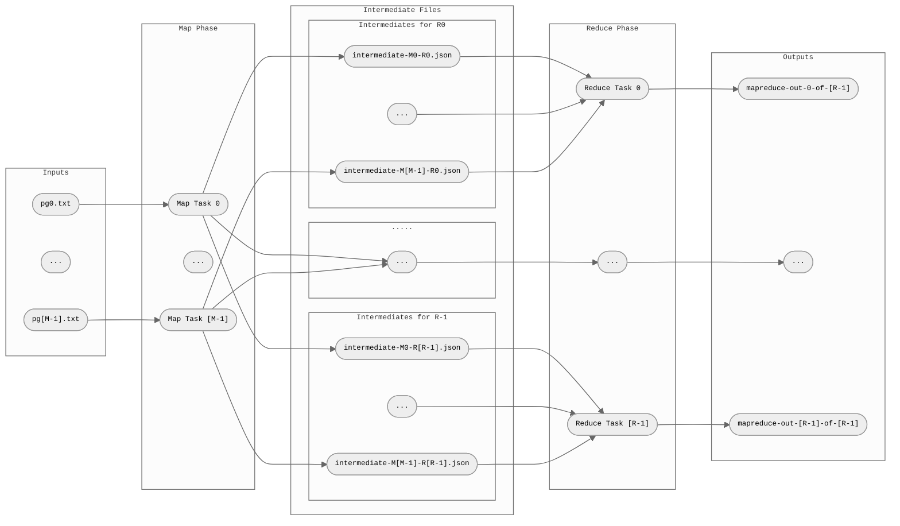

```mermaid
%%{init: {'theme': 'neutral', 'themeVariables': { 'fontFamily': 'monospace', 'fontSize': '10px'}}}%%
flowchart LR

    %% ------------------------------------------------
    %% 1) INPUT FILES
    %% ------------------------------------------------
    subgraph Inputs
        direction TB
        i0(["pg0.txt"]):::input
        iDots(["..."]):::input
        iM_1(["pg[M-1].txt"]):::input
    end

    %% ------------------------------------------------
    %% 2) MAP TASKS
    %% ------------------------------------------------
    subgraph Map Phase
        direction TB
        M0([Map Task 0]):::map
        Mdots(["..."]):::map
        Mlast(["Map Task [M-1]"]):::map
    end

    %% Edges from inputs to corresponding map tasks
    i0 --> M0
    %% iDots --> Mdots
    iM_1 --> Mlast

    %% ------------------------------------------------
    %% 3) INTERMEDIATE FILES
    %% ------------------------------------------------
    %% We'll illustrate two "rows" of intermediate outputs,
    %% one for Reduce Task 0 and one for Reduce Task (R-1).
    %% The "..." between them indicates potentially more reduce partitions.
    subgraph Intermediate Files
        direction TB

        subgraph Intermediates for R0
        direction TB
            IR00(["intermediate-M0-R0.json"]):::intermediate
            IRdots0(["..."]):::intermediate
            IRM_1_0(["intermediate-M[M-1]-R0.json"]):::intermediate
        end

        subgraph "....."
        direction TB
        %% The middle '...' indicates R1, R2, ... R(R-2) partitions
        middleDots(["..."]):::intermediate
        end

        subgraph Intermediates for R-1
        direction TB
            IR0R(["intermediate-M0-R[R-1].json"]):::intermediate
            IRdotsR(["..."]):::intermediate
            IRM_1_R(["intermediate-M[M-1]-R[R-1].json"]):::intermediate
        end
    end

    %% Map task outputs -> appropriate intermediate files (conceptually).
    M0 --> IR00
    M0 --> IR0R
    M0 --> middleDots
    
    %% Mdots --> IRdots0
    %% Mdots --> IRdotsR
    %% Mdots --> middleDots

    Mlast --> middleDots
    Mlast --> IRM_1_0
    Mlast --> IRM_1_R

    %% ------------------------------------------------
    %% 4) REDUCE TASKS
    %% ------------------------------------------------
    subgraph Reduce Phase
        direction TB
        R0([Reduce Task 0]):::reduce
        Rdots(["..."]):::reduce
        Rlast(["Reduce Task [R-1]"]):::reduce
    end

    %% Intermediate files -> corresponding reduce tasks
    IR00 --> R0
    IRdots0 --> R0
    IRM_1_0 --> R0

    middleDots --> Rdots

    IR0R --> Rlast
    IRdotsR --> Rlast
    IRM_1_R --> Rlast

    %% ------------------------------------------------
    %% 5) OUTPUTS
    %% ------------------------------------------------
    subgraph Outputs
        direction TB
        out0(["mapreduce-out-0-of-[R-1]"]):::output
        outDots(["..."]):::output
        outLast(["mapreduce-out-[R-1]-of-[R-1]"]):::output
    end

    %% Final outputs after reduce
    R0 --> out0
    Rdots --> outDots
    Rlast --> outLast
```
