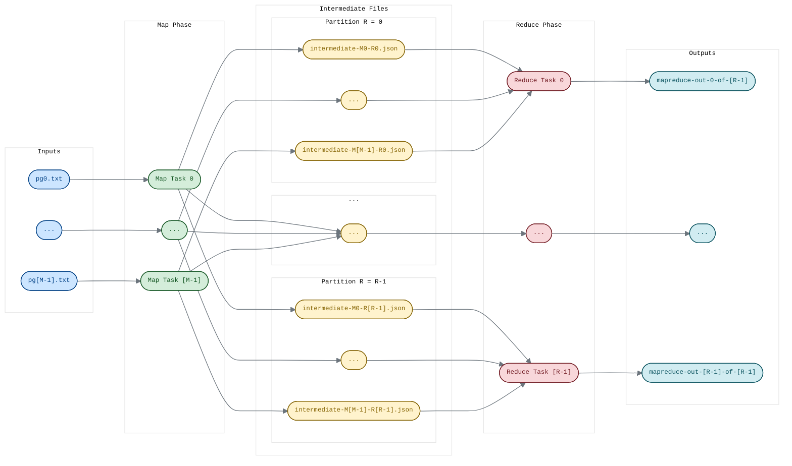

# distributed MapReduce framework in Go




a lightweight implementation of MapReduce (https://research.google.com/archive/mapreduce-osdi04.pdf) with a master / worker architecture written entirely in Go’s standard library.
workers may join and leave at any time; the master detects failures, re-assigns unfinished tasks, and guarantees that each map or reduce job is applied at most once.


## components

### [master coordinator (`cmd/master/`)](./cmd/master/)
-	creates a Map task for every input file and a configurable number of Reduce partitions (`NReduce`).
-	exposes two RPC methods over a Unix-domain socket (`/var/tmp/mapreduce-master.sock`):
    - WorkerTaskRequest: hands out new work
    - WorkerTaskUpdate: records progress/completion.
-	tracks every task’s State (Idle | InProgress | Completed | Error) and reverts a task to Idle if the assigned worker is silent for 10s.
-	when all maps finish, automatically groups the emitted intermediate JSON files into reduce buckets and spins up Reduce tasks.
-	shuts down cleanly after the last reduce completes

### [worker process (`cmd/worker/`)](./cmd/worker/)
-	dynamically loads any Go plugin (.so) that exports:
```go
    func Map(filename, contents string) []mapreduce.KVPair
    func Reduce(key string, values []string) string
```
(see [plugins/](./plugins/) for examples).

-   idle workers continously poll the master coordinator for new MapTasks or ReduceTasks to execute
-	map phase: reads its input split `M`, calls Map, hashes keys to obtain the reduce bucket number `r`, and writes `intermediate-M-r.json` for each.
-	reduce phase: reads each `[intermediate-1-r.json, intermediate-2-r.json, .., intermediate-M-r.json]` for a specific `r` bucket, sorts by key & groups together, calls Reduce, and writes `mapreduce-out-r-of-R`.
-	retries: if a task times out or the worker crashes, another worker re-executes it; duplicate execution is harmless by design.

### [core library (`mapreduce/`)](./mapreduce/)
-	RPC types & helpers – TaskType, TaskState, TaskResponseType, CallMaster
-	task scheduler – logic for timeouts, re-assignment, and reduce-task synthesis lives in [`master.go`](./mapreduce/master.go)
-	worker runtime – [`worker.go`](./mapreduce/worker.go) contains the event loop, map/reduce helpers, and a readable worker name generator (e.g., GroovyLynx_4242).

### [example plugins (`plugins/`)](./plugins/)
| name                            | description                                  | path                                                               |
|---------------------------------|----------------------------------------------|--------------------------------------------------------------------|
| `wordcounter`                   | canonical “word count”                       | [plugins/wordcounter/wordcounter.go](./plugins/wordcounter/wordcounter.go) |
| `inverted-index`                | emits word -> [file, positions]              | [plugins/inverted-index/inverted-index.go](./plugins/inverted-index/inverted-index.go) |
| `map-timing` / `reduce-timing`  | verify parallelism                           | [plugins/map-timing/map-timing.go](./plugins/map-timing/map-timing.go) and [plugins/reduce-timing/reduce-timing.go](./plugins/reduce-timing/reduce-timing.go) |
| `jobcount`                      | ensure each map runs once                    | [plugins/jobcount/jobcount.go](./plugins/jobcount/jobcount.go) |
| `reduce-delay`                  | stress long‐running reduce                   | [plugins/reduce-delay/reduce-delay.go](./plugins/reduce-delay/reduce-delay.go) |
| `wordcounter-crash-delay`       | random crashes & delays to test recovery     | [plugins/wordcounter-crash-delay/wordcounter-crash-delay.go](./plugins/wordcounter-crash-delay/wordcounter-crash-delay.go) |

### minimal sequential runner ([cmd/sequential/](./cmd/sequential/))
a single-process baseline used only to verify the correctness of the distributed version's output.

------

## technical highlights
- fault-tolerant scheduling – master marks a task Expired after 10 s of silence and hands it to another worker.
- at-most-once semantics – duplicates are possible but harmless; tests confirm final output equals sequential ground truth.
- parallel map & reduce – any idle worker can execute any pending task, enabling full utilisation of machines across clusters.
- plugin architecture – swap in a new .so without recompiling the framework.
- temporary‐file pattern - every intermediate and final output is first written to a randomly‐named temp file (via os.CreateTemp), then atomically renamed to its final, deterministic filename
    - this prevents partial writes if a worker crashes mid‐write
- comprehensive test harness – test.sh runs six end-to-end scenarios: crash/retry, early exit, timing, etc.


